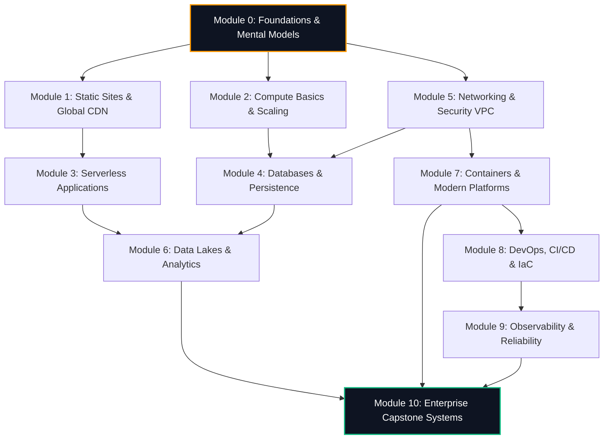

# AWS Architecture Guide – Production-Grade Technical Requirements
## Document: `requirements.md` (Version: 2.0.0-PROD)

---

### 1. System Vision & Architecture Paradigm
Cloud documentation is fundamentally reference-heavy: it documents *what* APIs and parameters exist, but routinely misses *why* specific topologies are selected under distinct business constraints, cost boundaries, and reliability thresholds.

**AWS Architecture Guide** is an open-source, ultra-high-performance static architectural repository built on **Astro.js**. It trains engineers and architects using a **First-Principles, Scenario-Driven Architectural Methodology**. Every module and case study models real-world enterprise engineering: dissecting business goals, evaluating trade-offs across the AWS Well-Architected Framework (Reliability, Cost Optimization, Performance Efficiency, Security, Operational Excellence, and Sustainability), providing high-fidelity interactive Mermaid diagrams, and validating design choices with quantitative business metrics.

```
┌─────────────────────────────────────────────────────────────────────────┐
│                   THE ARCHITECTURAL CASE STUDY LIFECYCLE                │
├─────────────────┬───────────────────┬───────────────────┬───────────────┤
│ 1. Problem      │ 2. Constraints    │ 3. Design Options │ 4. Production │
│    Definition   │    & Budget       │    & Trade-offs   │    Topology   │
│                 │                   │                   │               │
│ • Business Need │ • Latency (p99)   │ • Option A (PaaS) │ • Interactive │
│ • Bottlenecks   │ • Availability    │ • Option B (SaaS) │   Mermaid     │
│ • Legacy Tech   │ • RTO / RPO       │ • Chosen Option   │ • IaC Snippet │
│ • Scale Target  │ • Cost / Mo Limit │ • Trade-off Matrix│ • Metrics/ROI │
└─────────────────┴───────────────────┴───────────────────┴───────────────┘
```

---

### 2. Comprehensive Curriculum Architecture (Modules 0 to 10)

The platform encompasses **11 Comprehensive Learning Modules** housing **32 Production-Grade Case Studies**:



#### Module Matrix & Technical Scope

| Module ID & Title | Domain & Core Concepts | Primary AWS Services | Case Study Catalog |
| :--- | :--- | :--- | :--- |
| **`00-foundations`**<br>Architecture Foundations | • Shared Responsibility Model<br>• AWS Global Infra (Regions, AZs, Local Zones, Edge)<br>• Cost Mindset & Free Tier Trap Guard<br>• Reading & Authoring Architecture Diagrams<br>• Well-Architected 6 Pillars | • IAM Core<br>• AWS Budgets<br>• Cost Anomaly Detection<br>• AWS Organizations<br>• Service Quotas | 1. **Case Study Methodology**: Deconstructing enterprise architecture from ambiguous business specs.<br>2. **Free-Tier & Budget Trap Guard**: Automated anomaly detection, SCPs, and billing circuit-breakers.<br>3. **Diagram Literacy & Topologies**: Translating logical multi-tier diagrams to physical subnet mappings. |
| **`01-static-website`**<br>Static Hosting & CDN | • Global Edge Distribution & Anycast Routing<br>• Origin Access Control (OAC) with SigV4<br>• TLS/SSL Termination & Automated Renewal<br>• Edge Compute & Security Headers<br>• Cache Invalidation Strategies | • S3 Object Storage<br>• CloudFront CDN<br>• Route 53 (Alias records)<br>• AWS Certificate Manager (ACM)<br>• CloudFront Functions | 1. **Zero-Maintenance Developer Portfolio**: Sub-cent/month static hosting with custom domain and automatic SSL.<br>2. **Viral Startup Marketing Landing Page**: Absorbing 50k req/sec viral traffic surges with 99.8% edge cache hit ratio.<br>3. **Global Multi-Language Enterprise Blog**: Edge-localized content routing and security headers (CSP, HSTS) with CloudFront Functions. |
| **`02-compute-basics`**<br>Compute & Scaling | • Vertical vs Horizontal Scaling<br>• Target Tracking vs Step Auto-Scaling Policies<br>• Application Load Balancer (ALB) Routing Rules<br>• Sticky Sessions & Health Check Semantics<br>• EBS Volume Types (gp3, io2) & IOPS | • EC2 (Instances & AMIs)<br>• Auto Scaling Groups (ASG)<br>• ALB / NLB<br>• Elastic Beanstalk<br>• EBS Storage | 1. **Legacy Monolith Web App Migration**: Re-hosting a stateful Django app to multi-AZ ASG with externalized Redis sessions.<br>2. **High-Traffic Internal Analytics Portal**: Scheduled scaling and spot instance fleets for predictable enterprise shift usage. |
| **`03-serverless-apps`**<br>Event-Driven Serverless | • Ephemeral Compute & Execution Environments<br>• Cold Starts vs Provisioned Concurrency<br>• Lambda Event Source Mappings vs Direct Invocations<br>• Idempotency & Poison Pill Handling with DLQs<br>• Asynchronous Choreography vs Orchestration | • AWS Lambda<br>• API Gateway (HTTP vs REST)<br>• DynamoDB<br>• Amazon EventBridge<br>• Amazon SQS & SNS<br>• AWS Step Functions | 1. **Real-Time Image Processing Pipeline**: S3 upload event triggering async thumbnail generation and Rekognition metadata tagging.<br>2. **Resilient Webhook Ingestion Engine**: High-throughput webhook buffer using API Gateway direct SQS integration.<br>3. **High-Scale Serverless URL Shortener**: Sub-15ms global redirects using API Gateway HTTP APIs and DynamoDB single-digit ms reads. |
| **`04-databases`**<br>Databases & Persistence | • Relational vs Document vs Key-Value vs In-Memory<br>• ACID Transactions vs BASE Eventual Consistency<br>• Read Replicas & Connection Pooling (RDS Proxy)<br>• Aurora Serverless v2 Auto-scaling ACUs<br>• DynamoDB Single-Table Design & Partition Keys | • Amazon RDS (PostgreSQL/MySQL)<br>• Amazon Aurora Serverless v2<br>• Amazon DynamoDB<br>• Amazon ElastiCache (Redis)<br>• AWS RDS Proxy | 1. **E-Commerce Orders & Catalog Split**: ACID transaction handling in Aurora combined with low-latency DynamoDB catalog reads.<br>2. **Distributed Global Session Store**: Multi-region session clustering and TTL expiration using ElastiCache Redis.<br>3. **Sub-Millisecond Gaming Leaderboard**: High-write velocity leaderboard system utilizing Redis Sorted Sets with DynamoDB persistence. |
| **`05-networking-security`**<br>Networking & Security | • VPC CIDR Calculation & Subnet Slicing<br>• Route Tables, Internet Gateways & NAT Gateways<br>• Stateful Security Groups vs Stateless NACLs<br>• VPC Endpoints & AWS PrivateLink (Cost Optimization)<br>• Envelope Encryption with AWS KMS (CMK) | • Amazon VPC<br>• NAT Gateway / VPC Endpoints<br>• AWS IAM (Roles, Policies, SCPs)<br>• AWS KMS<br>• AWS Secrets Manager<br>• AWS WAF | 1. **Production 3-Tier Enterprise VPC**: Complete network isolation separating public ingress, private app compute, and isolated DB tiers.<br>2. **Zero-Trust Financial Backend**: Eliminating NAT gateway egress data fees using VPC Interface Endpoints and KMS CMK envelope encryption. |
| **`06-data-analytics`**<br>Data Lakes & Analytics | • Schema-on-Read vs Schema-on-Write<br>• Data Lake Partitioning (Hive style `year/month/day`)<br>• Columnar File Formats (Apache Parquet, Snappy)<br>• Distributed Querying without Dedicated Servers<br>• Streaming Ingestion vs Batch Micro-batches | • Amazon S3 Lakehouse<br>• AWS Glue (Crawler & Data Catalog)<br>• Amazon Athena<br>• Amazon Kinesis Data Streams<br>• Amazon Redshift Serverless | 1. **Real-Time Clickstream Analytics**: Streaming 20,000 events/sec through Kinesis Data Firehose into S3 Parquet partitions queried via Athena.<br>2. **Centralized Enterprise Security Log Lake**: Multi-account CloudTrail and VPC Flow Log ingestion, automated Glue partitioning, and Athena forensics.<br>3. **Executive BI Datamart Pipeline**: Automated batch ETL pipeline transforming raw transaction logs into Redshift Serverless dimensional models. |
| **`07-containers`**<br>Containers & Kubernetes | • Containers vs VMs vs Serverless<br>• ECS Task Definitions, Services & Fargate Launch Types<br>• EKS Control Plane, Managed Node Groups & Fargate Profiles<br>• Ingress Controllers, ALB Integration & Target Tracking<br>• Container Security & IAM Roles for Service Accounts (IRSA) | • Amazon ECS (AWS Fargate)<br>• Amazon EKS (Kubernetes)<br>• Amazon ECR<br>• AWS App Mesh / Cloud Map<br>• AWS Distro for OpenTelemetry | 1. **Monolith to Microservices on Fargate**: Decomposing a Rails monolith into containerized Fargate microservices with ALB path-based routing.<br>2. **High-Resiliency Multi-Tenant EKS Platform**: Kubernetes on AWS with Karpenter auto-scaling, IRSA least-privilege, and AWS Load Balancer Controller. |
| **`08-devops-iac`**<br>DevOps, CI/CD & IaC | • Immutable Infrastructure & Configuration Drift<br>• GitOps Delivery Pipelines & Automated Gates<br>• Blue/Green & Canary Traffic Shifting Algorithms<br>• Declarative CloudFormation vs CDK vs Terraform<br>• State Locking, Remote Backends & Secret Injection | • AWS CodePipeline<br>• AWS CodeBuild<br>• AWS CodeDeploy<br>• AWS CDK (TypeScript)<br>• HashiCorp Terraform<br>• AWS Systems Manager | 1. **Automated Multi-Environment GitOps Engine**: Trunk-based development pipeline deploying to Dev/Staging/Prod with synthetic smoke test gates.<br>2. **Zero-Downtime Blue/Green Traffic Shifting**: Progressive canary deployment (10% → 50% → 100%) with automated CloudWatch alarm rollbacks. |
| **`09-observability`**<br>Observability & Reliability | • The 3 Pillars of Observability (Metrics, Logs, Traces)<br>• Distributed Tracing & W3C Trace Context Propagation<br>• MTTR Minimization & Composite Alarms<br>• AWS Config Compliance Rules & Automated Remediation<br>• Chaos Engineering & Fault Injection (AWS FIS) | • Amazon CloudWatch (Metrics/Logs/Alarms)<br>• AWS X-Ray<br>• AWS CloudTrail<br>• AWS Config<br>• AWS Fault Injection Simulator (FIS) | 1. **Automated Incident Detection & Self-Healing**: CloudWatch composite alarms triggering automated Lambda remediation and PagerDuty escalations.<br>2. **Cloud Cost Anomaly Sentinel**: Proactive FinOps detection engine hunting zombie EBS volumes, unattached Elastic IPs, and idle RDS instances. |
| **`10-capstones`**<br>Real-World Capstone Systems | • Active-Active Multi-Region Resiliency<br>• High-Throughput Video Ingestion & Transcoding<br>• Strict Zero-RPO / RTO Banking Architectures<br>• Multi-Tenant SaaS Isolation (Silo vs Pool Models)<br>• High-Scale IoT Device Telemetry Ingestion | • Route 53 Arc<br>• DynamoDB Global Tables<br>• AWS Elemental MediaConvert<br>• AWS IoT Core<br>• Amazon Timestream<br>• Amazon Aurora Global Database | 1. **Netflix-Scale Adaptive Video Streaming**: Global media ingest, distributed chunked transcoding, origin shielding, and dynamic tokenized CDN delivery.<br>2. **FinTech Multi-Region Active-Active Banking Core**: Zero-RPO distributed ledger across `us-east-1` and `us-west-2` with DynamoDB Global Tables.<br>3. **Global Multi-Tenant B2B SaaS Platform**: Hybrid tenant isolation with dynamic database tenant partitioning, IAM ABAC, and tenant metering.<br>4. **Smart Connected Fleet Telemetry Engine**: Ingesting telemetry from 500,000 vehicles via AWS IoT Core MQTT into Timestream with anomaly alerting. |

---

### 3. Rigorous 11-Part Case Study Anatomy Contract

Every case study markdown file strictly enforces the following 11-section anatomy:

```
┌────────────────────────────────────────────────────────────────────────┐
│ 1. Metadata Header: Title, Summary, Time, Difficulty, Services, Tags  │
├────────────────────────────────────────────────────────────────────────┤
│ 2. Business Problem & Context (Legacy System Flaws, Business Bottleneck)│
├────────────────────────────────────────────────────────────────────────┤
│ 3. Requirements & Constraints Matrix (SLOs, SLAs, RTO/RPO, Budget)     │
├────────────────────────────────────────────────────────────────────────┤
│ 4. Interactive Architecture Canvas (Mermaid Diagram + Step-by-Step Flow)│
├────────────────────────────────────────────────────────────────────────┤
│ 5. AWS Services Breakdown & Justification (Why this service?)          │
├────────────────────────────────────────────────────────────────────────┤
│ 6. Architectural Trade-Offs Matrix (Option A vs Option B vs Chosen)    │
├────────────────────────────────────────────────────────────────────────┤
│ 7. Implementation Highlights & Code/IaC Recipes (Terraform/CDK/IAM)    │
├────────────────────────────────────────────────────────────────────────┤
│ 8. Results, Quantitative Benchmarks & Cost ROI Metrics                 │
├────────────────────────────────────────────────────────────────────────┤
│ 9. Critical Takeaways & Architectural Anti-Patterns to Avoid           │
├────────────────────────────────────────────────────────────────────────┤
│ 10. Interactive Knowledge Check (Scenario-based comprehension quiz)    │
├────────────────────────────────────────────────────────────────────────┤
│ 11. Related Modules, Prerequisites & Official AWS Reference Links      │
└────────────────────────────────────────────────────────────────────────┘
```

---

### 4. Non-Functional Performance & Quality SLAs

1. **Static First & Zero Bloat**:
   - 100% pre-rendered HTML via Astro Static Site Generation (`output: 'static'`).
   - Core reader pages render with **0 bytes of client-side JavaScript**.
   - Interactive islands (Mermaid viewer, Search modal, Quiz engine) load lightweight ES modules on idle/interaction.
2. **Core Web Vitals & Lighthouse Score Target**:
   - **Lighthouse Performance**: `100 / 100`
   - **LCP (Largest Contentful Paint)**: `< 0.8s`
   - **FID / INP (Interaction to Next Paint)**: `< 50ms`
   - **CLS (Cumulative Layout Shift)**: `0.00`
3. **Accessibility (a11y)**:
   - Full **WCAG 2.1 Level AA** compliance.
   - Screen-reader accessible landmark tags (`<main>`, `<nav>`, `<aside>`, `<header>`, `<footer>`).
   - High contrast ratios (Dark mode minimum 12:1 on text elements).
   - Complete keyboard traversability for search modal (`Cmd+K`, `/`, `ArrowDown`, `ArrowUp`, `Enter`, `Escape`).
4. **Offline Capability & Zero Network Latency**:
   - LocalStorage persistence for user bookmarks, completed case studies, and reading progress.
   - In-memory client-side search index (<200KB gzipped) enabling sub-5ms search query filtering.

---

### 5. Content Collections Type-Safe Schema Contract

```typescript
// src/content.config.ts (Strict Zod validation)
import { defineCollection, z } from 'astro:content';

export const collections = {
  modules: defineCollection({
    type: 'content',
    schema: z.object({
      moduleNumber: z.number().min(0).max(10),
      title: z.string(),
      tagline: z.string(),
      description: z.string(),
      theme: z.string(),
      keyServices: z.array(z.string()),
      difficulty: z.enum(['Beginner', 'Intermediate', 'Advanced', 'Expert']),
      estimatedHours: z.number(),
      icon: z.string(),
      order: z.number(),
      learningOutcomes: z.array(z.string()),
    }),
  }),

  'case-studies': defineCollection({
    type: 'content',
    schema: z.object({
      moduleId: z.string(),
      title: z.string(),
      summary: z.string(),
      difficulty: z.enum(['Beginner', 'Intermediate', 'Advanced', 'Expert']),
      estimatedMinutes: z.number(),
      industry: z.string(),
      architectureStyle: z.array(z.string()),
      awsServices: z.array(
        z.object({
          name: z.string(),
          category: z.enum([
            'Compute',
            'Storage',
            'Database',
            'Networking',
            'Serverless',
            'Analytics',
            'Containers',
            'Security',
            'DevOps',
            'Management',
            'IoT',
            'Media',
          ]),
          role: z.string(),
        })
      ),
      keyMetrics: z.array(
        z.object({
          label: z.string(),
          value: z.string(),
          trend: z.enum(['up', 'down', 'neutral']).optional(),
        })
      ),
      tags: z.array(z.string()),
      featured: z.boolean().default(false),
      order: z.number(),
    }),
  }),
};
```
