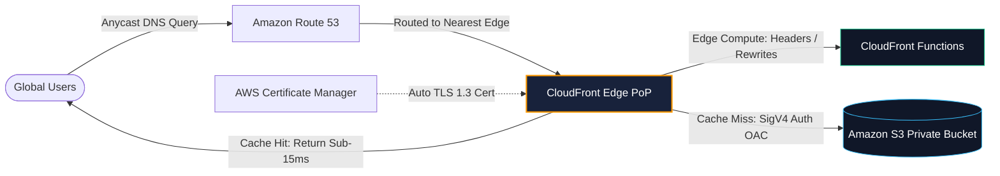

## The Static Architecture Philosophy
In traditional hosting, web servers (e.g. Apache, Nginx) handle file I/O, TLS negotiation, and connection keep-alives. When traffic spikes 1,000x, servers run out of file descriptors and memory.

By decoupling **storage (Amazon S3)** from **global distribution (Amazon CloudFront)**:
- S3 acts as a highly durable (11 9s) file store that is never directly exposed to the public internet.
- CloudFront's 450+ Edge Points of Presence (PoPs) cache content within milliseconds of end-users worldwide.
- TLS negotiation is offloaded to the edge, dropping Time to First Byte (TTFB) significantly.
- Costs collapse from $50–$300/month for VM clusters to mere cents per gigabyte transferred.

---

## Case Studies in This Module
1. **[Zero-Maintenance Developer Portfolio](/case-studies/personal-portfolio-docs)**: Sub-cent/month static hosting with custom domain and automatic SSL.
2. **[Viral Startup Marketing Landing Page](/case-studies/startup-marketing-site)**: Absorbing 50k req/sec viral traffic surges with 99.8% edge cache hit ratio.
3. **[Global Multi-Language Enterprise Blog](/case-studies/company-global-blog)**: Edge-localized content routing and security headers (CSP, HSTS) with CloudFront Functions.
