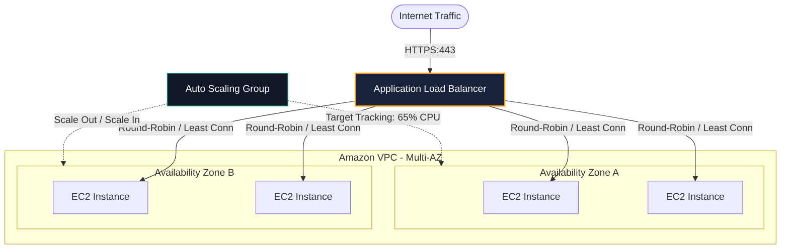

## The Evolution of Compute
Running workloads on virtual machines requires making critical architectural decisions:
1. **Vertical Scaling (Scale-Up)**: Upgrading from `t3.medium` to `c6i.4xlarge`. Simple, but introduces a single point of failure (SPOF) and a hard ceiling.
2. **Horizontal Scaling (Scale-Out)**: Distributing stateless compute nodes behind an **Application Load Balancer (ALB)** across multiple Availability Zones. When one AZ experiences an outage, healthy targets in other AZs continue handling requests.

---

## Case Studies in This Module
1. **[Legacy Monolith Web App Migration](/case-studies/monolith-web-migration)**: Re-hosting a stateful Django/Rails app to multi-AZ ASG with externalized Redis sessions.
2. **[High-Traffic Internal Analytics Portal](/case-studies/internal-analytics-portal)**: Predictable enterprise portal with scheduled scaling, spot instance fleets, and EBS snapshot backups.
