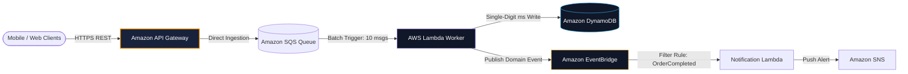

## The Serverless Mental Shift
Serverless is not merely running code without servers; it is a fundamental shift toward **event-driven choreography**:
- **Zero Idle Cost**: You pay strictly for execution milliseconds and IOPS. If zero users hit your service at 3 AM, your bill is exactly $0.00.
- **Micro-Concurrency**: Each request or event triggers an isolated execution container, eliminating traditional thread starvation and connection pool exhaustions.
- **Decoupled Buffering**: Direct integrations between API Gateway and SQS allow ingest spikes of 100,000 requests/sec without overloading downstream processors.

---

## Case Studies in This Module
1. **[Real-Time Image Processing Pipeline](/case-studies/image-processing-pipeline)**: S3 upload event triggering async thumbnail generation, watermarking, and metadata tagging.
2. **[Resilient Webhook Ingestion Engine](/case-studies/webhook-notification-system)**: High-throughput webhook ingestion buffering payloads into SQS via direct API Gateway integration.
3. **[High-Scale Serverless URL Shortener](/case-studies/serverless-url-shortener)**: Ultra-low cost, sub-15ms URL redirection service on API Gateway HTTP APIs + DynamoDB.
