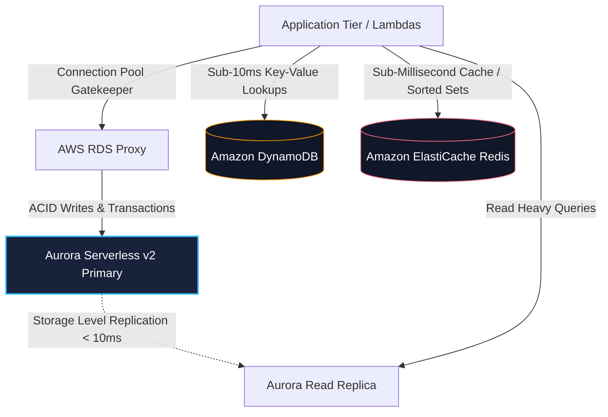

## The Database Selection Framework
Modern cloud architectures rarely rely on a single database. Instead, they leverage **polyglot persistence**:

| Database Engine | Primary Strengths | Scaling Model | Best Use Cases |
| :--- | :--- | :--- | :--- |
| **Amazon Aurora Serverless v2** | Full PostgreSQL/MySQL ACID compliance, sub-minute auto-scaling ACUs, storage auto-growth to 128TB. | Auto-scaling Compute (0.5 to 128 ACUs), Read Replicas with sub-10ms lag. | Core financial ledger, relational order processing, complex analytical joins. |
| **Amazon DynamoDB** | Single-digit millisecond latency at any scale, serverless pay-per-request, predictable partitioning. | Automatic partition scaling based on Partition Key (PK) hash. | Shopping carts, session states, user profiles, gaming telemetry, metadata indexes. |
| **Amazon ElastiCache (Redis)** | Microsecond in-memory response times, atomic counters, Sorted Sets, Pub/Sub. | Multi-node cluster with in-memory replication across AZs. | Real-time leaderboards, rate limiters, session stores, hot database query cache. |

---

## Case Studies in This Module
1. **[E-Commerce Orders & Catalog Split](/case-studies/ecommerce-catalog-orders)**: ACID transaction handling in Aurora combined with low-latency DynamoDB catalog reads.
2. **[Distributed Global Session Store](/case-studies/global-session-management)**: Distributed user authentication and session clustering with ElastiCache Redis.
3. **[Sub-Millisecond Gaming Leaderboard](/case-studies/realtime-gaming-leaderboard)**: High-write velocity leaderboard system utilizing Redis Sorted Sets with DynamoDB persistence.
