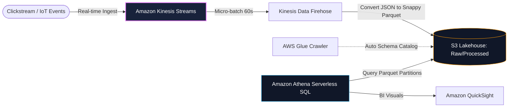

## The Serverless Lakehouse Architecture
Traditional data warehouses require costly, always-on provisioned clusters. The modern AWS Lakehouse architecture decouples **storage (S3)** from **serverless compute (Athena, Redshift Serverless)**:

---

## Case Studies in This Module
1. **[Real-Time Clickstream Analytics](/case-studies/realtime-clickstream-analytics)**: Streaming 20,000 events/sec through Kinesis Data Firehose into S3 Parquet partitions queried via Athena.
2. **[Centralized Enterprise Security Log Lake](/case-studies/centralized-security-log-lake)**: Aggregating multi-account CloudTrail and VPC Flow Logs into a searchable Glue/Athena lake.
3. **[Executive BI Datamart Pipeline](/case-studies/executive-bi-dashboard)**: Automated batch ETL pipeline transforming raw transaction logs into Redshift Serverless dimensional models.
