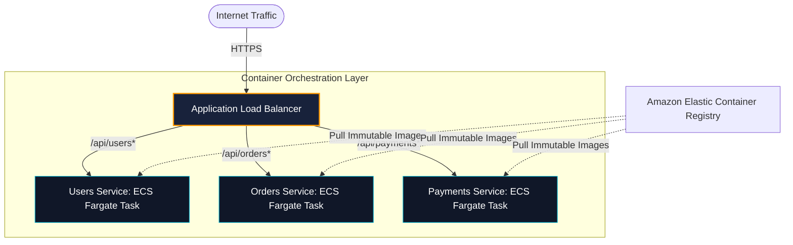

## Containers: ECS Fargate vs Amazon EKS
Choosing a container platform is one of the most consequential decisions for modern engineering organizations:

---

## Case Studies in This Module
1. **[Monolith to Microservices on Fargate](/case-studies/monolith-to-containers)**: Decomposing a monolithic Ruby/Django backend into Dockerized Fargate microservices with ALB path-based routing.
2. **[High-Resiliency Multi-Tenant EKS Platform](/case-studies/multiservice-ecommerce-platform)**: Polyglot microservices on Amazon EKS with Karpenter auto-scaling and AWS Load Balancer Controller.
