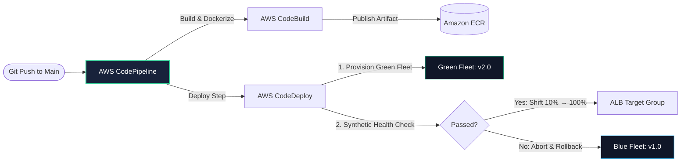

## The Zero-Downtime Deployment Lifecycle
In modern high-availability environments, code must be deployed continuously without dropping a single active customer HTTP connection:

---

## Case Studies in This Module
1. **[Automated Multi-Environment GitOps Engine](/case-studies/gitops-multienv-pipeline)**: Trunk-based development pipeline deploying to Dev/Staging/Prod with synthetic smoke test gates.
2. **[Zero-Downtime Blue/Green Traffic Shifting](/case-studies/zero-downtime-blue-green)**: Progressive canary traffic shifting (10% → 50% → 100%) with automated CloudWatch alarm rollbacks.
